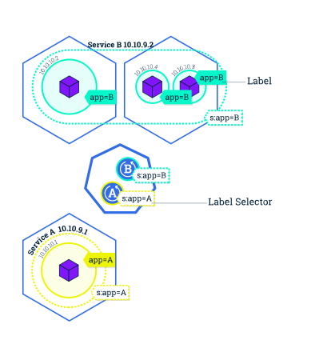

Title: Kubernetes Basics
Date: 2019-02-21
Modified: 2019-02-21
Tags: Kubernetes
Authors: Harry Zheng
Summary: Basic commands and tools in kubernetes

This article covers some basic commands and instructions to deploy a kubernetes app. Some notes and images are taken from `https://kubernetes.io/docs/tutorials`. 

## Basic concept

### Nodes
A kubernetes **cluster** is consist of **Nodes**. A node can be a VM or a physical machine. 


To check current nodes issue this command:

```
$ kubectl get nodes
NAME                 STATUS    ROLES     AGE       VERSION
docker-for-desktop   Ready     master    30m       v1.10.11
```

Each cluster should have one master node with a 0 or a few slave nodes.

### Pods
A node is consists of one or more **Pods**.  


To get list of running pods, issue this command:

```
$ kubectl get pods
NAME                                   READY     STATUS    RESTARTS   AGE
kubernetes-bootcamp-5c69669756-rmxrn   1/1       Running   0          45m
```

A Pod is a Kubernetes abstraction that represents a group of one or more application containers (such as Docker or rkt), and some shared resources for those containers. Those resources include:

* Shared storage, as Volumes
* Networking, as a unique cluster IP address
* Information about how to run each container, such as the container image version or specific ports to use


### Services

A Service in Kubernetes is an abstraction which defines a logical set of Pods and a policy by which to access them. Services enable a loose coupling between dependent Pods. A Service is defined using YAML (preferred) or JSON, like all Kubernetes objects. 


A Service routes traffic across a set of Pods. Services are the abstraction that allow pods to die and replicate in Kubernetes without impacting your application. Discovery and routing among dependent Pods (such as the frontend and backend components in an application) is handled by Kubernetes Services.

Services match a set of Pods using labels and selectors, a grouping primitive that allows logical operation on objects in Kubernetes. Labels are key/value pairs attached to objects and can be used in any number of ways:

* Designate objects for development, test, and production
* Embed version tags
* Classify an object using tags



### Networking

Pods running in side Kubernetes are running on a prviate, isolated network. By default, they are visible from other pods and services within the same cluster, but not outside. To quickly open on communication to outside world, `kubectl` can create a proxy to foward communications, 

`kubectl proxy` will create a proxy at `http://localhost:8001/version`. The API server will automatically create an endpoint for each pod, based on the pod name, that is also accessible through the proxy.

To access each individual pod, we need to get pod name. 
`export POD_NAME=$(kubectl get pods -o go-template --template '{{range .items}}{{.metadata.name}}{{"\n"}}{{end}}')`. 
Then we can make a HTTP request to the application in that pod. `curl http://localhost:8001/api/v1/namespaces/default/pods/$POD_NAME/proxy/`

## Tutorial

### Make an deployment
Run this commmand to make a new deployment. 
`kubectl run kubernetes-bootcamp --image=gcr.io/google-samples/kubernetes-bootcamp:v1 --port=8080`

Get the name of running pod, `export POD_NAME=$(kubectl get pods -o go-template --template '{{range .items}}{{.metadata.name}}{{"\n"}}{{end}}')`. 


### Check application configuration
Let’s verify that the application we deployed in the previous scenario is running. We’ll use the kubectl get command and look for existing Pods:

```
$ kubectl get pods
NAME                                   READY     STATUS    RESTARTS   AGE
kubernetes-bootcamp-5c69669756-rmxrn   1/1       Running   0          1h
```

Next, to view what containers are inside that Pod and what images are used to build those containers we run the describe pods command:
`kubectl describe pods`.

### View container logs
Anything that the application would normally send to STDOUT becomes logs for the container within the Pod. We can retrieve these logs using the kubectl logs command:
`kubectl logs $POD_NAME`

Note: We don’t need to specify the container name, because we only have one container inside the pod.

### Executing command on the container
We can execute commands directly on the container once the Pod is up and running. For this, we use the exec command and use the name of the Pod as a parameter. Let’s list the environment variables: 

```
$ kubectl exec $POD_NAME env
PATH=/usr/local/sbin:/usr/local/bin:/usr/sbin:/usr/bin:/sbin:/bin
HOSTNAME=kubernetes-bootcamp-5c69669756-rmxrn
KUBERNETES_PORT=tcp://10.96.0.1:443
KUBERNETES_PORT_443_TCP=tcp://10.96.0.1:443
KUBERNETES_PORT_443_TCP_PROTO=tcp
KUBERNETES_PORT_443_TCP_PORT=443
KUBERNETES_PORT_443_TCP_ADDR=10.96.0.1
KUBERNETES_SERVICE_HOST=10.96.0.1
KUBERNETES_SERVICE_PORT=443
KUBERNETES_SERVICE_PORT_HTTPS=443
NPM_CONFIG_LOGLEVEL=info
NODE_VERSION=6.3.1
HOME=/root
```
Again, worth mentioning that the name of the container itself can be omitted since we only have a single container in the Pod.

Next let’s start a bash session in the Pod’s container: `kubectl exec -ti $POD_NAME bash`.  We have now an open console on the container. To close the console, use `exit`. 

### Create a new service

To list current services in the cluster: 

```
$ kubectl get services
NAME         TYPE        CLUSTER-IP   EXTERNAL-IP   PORT(S)   AGE
kubernetes   ClusterIP   10.96.0.1    <none>        443/TCP   1h
```

Cluter services is created by default. 

To create a new service using running pods: `kubectl expose deployment/kubernetes-bootcamp --type="NodePort" --port 8080`

List services again:

```
$ kubectl get services
NAME                  TYPE        CLUSTER-IP      EXTERNAL-IP   PORT(S)          AGE
kubernetes            ClusterIP   10.96.0.1       <none>        443/TCP          1h
kubernetes-bootcamp   NodePort    10.104.156.85   <none>        8080:30527/TCP   2s
```
Notice that the new service `kubernetes-bootcamp` has a unique cluster-IP `10.104.156.85`, an internal port `30527` and an external port `8080`. 

Try access the end point with `curl 10.104.156.85:8080`. 

### Using labels

The Deployment created automatically a label for our Pod. With describe deployment command you can see the name of the label: `kubectl describe deployment`. 

This label can be used to query list of Pods:

```
$ kubectl get pods -l run=kubernetes-bootcamp
NAME                                   READY     STATUS    RESTARTS   AGE
kubernetes-bootcamp-5c69669756-rmxrn   1/1       Running   0          1h
```

The same can be used on services:
```
$ kubectl get services -l run=kubernetes-bootcamp
NAME                  TYPE       CLUSTER-IP      EXTERNAL-IP   PORT(S)          AGE
kubernetes-bootcamp   NodePort   10.104.156.85   <none>        8080:30527/TCP   24m
```

Get name of the pod: `export POD_NAME=$(kubectl get pods -o go-template --template '{{range .items}}{{.metadata.name}}{{"\n"}}{{end}}')`

Apply a new label to this pod: `kubectl label pod $POD_NAME app=v1`

And check the pod description: 

```
$ kubectl describe pods $POD_NAME`
Name:           kubernetes-bootcamp-5c69669756-rmxrn
Namespace:      default
Node:           docker-for-desktop/192.168.65.3
Start Time:     Thu, 21 Feb 2019 14:51:05 -0700
Labels:         app=v1
                pod-template-hash=1725225312
                run=kubernetes-bootcamp
...
```

This label can be used to query pods:

```
$ kubectl get pods -l app=v1
NAME                                   READY     STATUS    RESTARTS   AGE
kubernetes-bootcamp-5c69669756-rmxrn   1/1       Running   0          1h
```

### Delete a service

To delete a service, use this command `kubectl delete service -l run=kubernetes-bootcamp`

Confirm the service is gone:

```
$ kubectl get services
NAME         TYPE        CLUSTER-IP   EXTERNAL-IP   PORT(S)   AGE
kubernetes   ClusterIP   10.96.0.1    <none>        443/TCP   2h
```

But the pod should still be running:

```
$ kubectl exec -ti $POD_NAME curl localhost:8080
Hello Kubernetes bootcamp! | Running on: kubernetes-bootcamp-5c69669756-rmxrn | v=1
```

## Kubernetes Commands

* check current version: `kubectl version`
* get cluster info: `kubectl cluster-info`
* list nodes: `kubectl get nodes`
* list pods: `kubectl get pods`
* run a deployment: `kubectl run kubernetes-bootcamp --image=gcr.io/google-samples/kubernetes-bootcamp:v1 --port=8080`
* list deployments: `kubectl get deployments`


