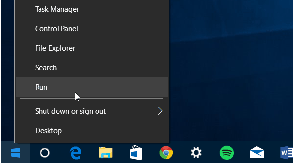
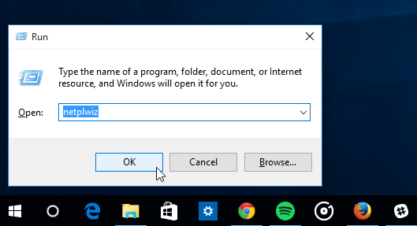
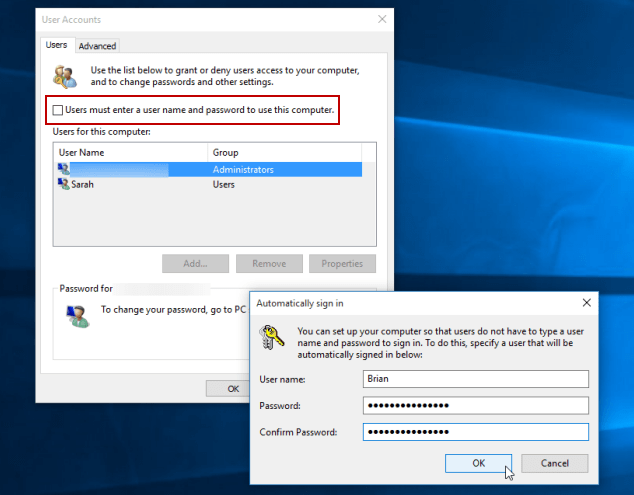

Title: MacOS OneDrive using VM
Date: 2020-05-02
Modified: 2020-05-02
Tags: VM, OneDrive
Authors: Harry Zheng
Summary: Install Windows 10 on VM and share its OneDrive as smb share to MacOS 


## Introduction

I have been struggling on OneDrive's performance on my MacOS. It's constantly updating and whenever I reboot the machine. It will try to update the entire OneDrive folder again. I have a lot of files in OneDrive. One scan can easily take 10+ hours. 

OneDrive on my Windows 10 seems to perform well. So I thought, maybe I can install Windows 10 VM on my MacOS and let it sync OneDrive files for me. 

### Goal

Install Windows 10 on VM in MacOS and sync OneDrive from Windows. Setup a file sharing system between MacOS and Windows 10 so that MacOS can access these files in Windows 10 VM.  

User story:

1. As a user, I want to be able to access OneDrive folder on my Windows 10 VM from MacOS
2. As a user, I want the OneDrive folder to be functioning and available me when I boot into MacOS

### Related Work

* VirtualBox, https://www.virtualbox.org/, VirtualBox is a powerful x86 and AMD64/Intel64 virtualization product for enterprise as well as home use. 
* `mount_smbfs`, a command to mount smb share on MacOS

## Solution

### Install VM and Windows 10

First step is to setup VM and install Windows 10 on there.  

* Download VirtualBox installer for MacOS from https://www.virtualbox.org/. Intall VirtualBox by double clicking the installer.
* Download Windows 10 installer ISO from https://www.microsoft.com/en-ca/software-download/windows10. 

Launch VirtualBox and create a new VM. Configure all settings to your preference, it doesn't matter. The goal is to have a functioning Windows 10 installation. In Network selection, make sure to select `Bridged Adapter`. This is crucial for MacOS to detect Windows samba share. 

### Configure Windows 10 VM

Now we have a Windows 10 running, go ahead and configure OneDrive to sync. Once OneDrive folder is created in your home folder. Right click the folder and choose `Properties`. Enable sharing in the folder using current user. Make sure your configured your network to private network so that your computer is discoverable as well. 

Now we have the folder shared on the network, you can confirm that from MacOS. 

Go to Finder on Mac and go to `Shared`, you should see a shared computer like `desktop-xxxx`, which is your Windows VM's desktop name. You can try connect to it by double clicking and enter your Windows 10's login. 

### Auto login Windows 10 VM

To allow OneDrive sharing when we boot Windows 10 VM, we need to auto login. On Windows 10 VM,   

1. Right click Start and select `Run`
   
2. Type `netplwiz` and hit Enter or click OK. 
   
3. Uncheck `Users must enter a user name and password to use this computer` and click OK.
   
4. Enter in your user name and the password you use to log into your system twice and **click** OK.

Next time Windows 10 boots, it will auto login using this user. 

### Configure MacOS to launch Windows 10 on boot and connect to the smb share

We use launchagents to start VM in `headless` mode and connect to the smb share. Save the following file in `/Users/xxxx/Library/LaunchAgents/` folder with name `org.virtualbox.launch.windows10.plist`. In the file content, replace `xxxx` with your user folder name. 

```
<?xml version="1.0" encoding="UTF-8"?>
<!DOCTYPE plist PUBLIC "-//Apple//DTD PLIST 1.0//EN" "http://www.apple.com/DTDs/PropertyList-1.0.dtd">
<plist version="1.0">
<dict>
	<key>Label</key>
	<string>org.virtualbox.launch.windows10.plist</string>
	<key>ProgramArguments</key>
	<array>
		<string>/Users/xxxx/.bin/launch_vm</string>
	</array>
	<key>RunAtLoad</key>
	<true/>
</dict>
</plist>

```

Notice it's using `/Users/xxxx/.bin/launch_vm`. We need to create this file,

```
MACHINE=Windows10

/Applications/VirtualBox.app/Contents/MacOS/VBoxManage startvm $MACHINE --type headless

# use %40 for @ in your password
until mount_smbfs '//user:pwd@desktop-gkiv4p8/Users/xxxx/OneDrive' /Users/xxxx/OneDrive
do
  echo "Waiting for machine to come online"
  sleep 1
done
```

Also create `OneDrive` folder in your MacOS user home folder. 

### Testing

That's everything. To test the setup, shutdown Windows 10 VM. Wait for Windows 10 to shut down. 

To test everything, using this command `launchctl load org.virtualbox.launch.windows10.plist` in terminal. This will start Windows 10 in headless mode and you won't see it show up. It will also mount the smb drive to OneDrive folder in your MacOS home directory. 

### Final test

Reboot MacOS and make sure OneDrive is mounted automatically and you can see files in your MacOS's OneDrive folder. 

## Alternative Solution

I've also tried Parallel Desktop as it allows to share from guest to host. But Parallel is having performance issues in latest Windows 10 and the VM constantly freezes. 
