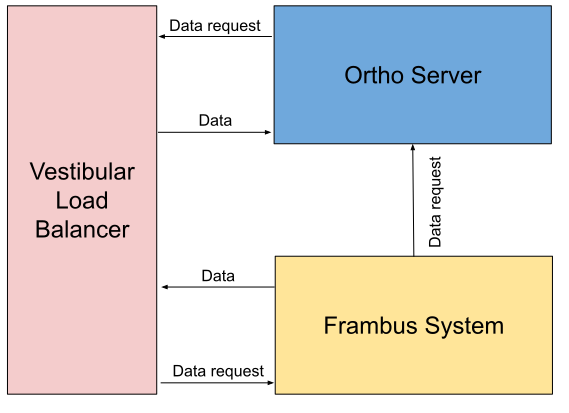
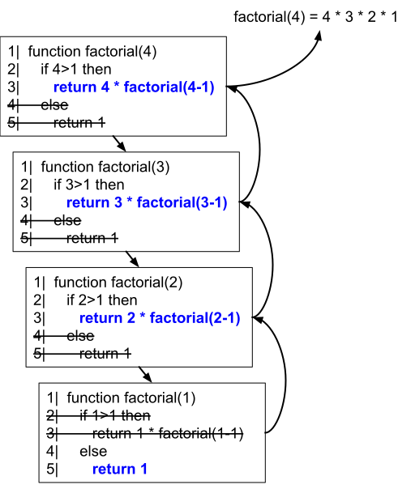

Title: Illustrating
Date: 2020-04-15
Modified: 2020-04-15
Category: Writing
Tags: writing
Authors: Google
Summary: Illustrating

Copied from, https://developers.google.com/tech-writing. 

Illustrating
============

**Estimated Time:** 10 minutes

Remember when your teacher assigned you a hefty chapter to read? You flipped through the assigned section of the textbook, desperately hoping for...yes, pictures! Viewing illustrations was so much more fun than reading text. In fact, when it comes to reading technical material, the vast majority of adults are still little kids---still yearning for pictures rather than text.

**Figure 1. Good graphics engage readers in ways that text cannot.**

[Nirmal Dulal [CC BY-SA 4.0 (https://creativecommons.org/licenses/by-sa/4.0)]](https://commons.wikimedia.org/wiki/File:Nepalese_Children.JPG)

According to research by [Sung and Mayer (2012)](https://www.sciencedirect.com/science/article/pii/S0747563212000921), providing any graphics---good or bad---makes readers like the document more; however, only *instructive* graphics help readers learn. This unit suggests a few ways to help you create figures truly worth a thousand words.

Write the caption first
-----------------------

Often times, it is helpful to write the caption *before* creating the illustration. Then, create the illustration that best represents the caption. This process helps you to check that the illustration matches the goal.

Good captions have the following characteristics:

-   They are **brief**. Typically, a caption is just a few words.
-   They explain the **takeaway**. *After viewing this graphic, what should the reader remember?*
-   They **focus** the reader's attention. Focus is particularly important when a photograph or diagram contains a lot of detail.

### Exercise

Target Audience: CS undergraduate students taking an "Introduction to Data Structures" class.

Consider the following three figures, each of which uses the same caption.

**Caption A. A single-linked list holds content and a pointer to the next node.**

**Caption B. A single-linked list holds content and a pointer to the next node.**

**Caption C. A single-linked list holds content and a pointer to the next node.**

Which of the three preceding figures best illustrates its caption?

#### Click the icon to see the answer.

-   Figure A is bad. The chain is pretty, but information-free. The chain also erroneously implies that a single-linked list points both backwards and forwards.
-   Figure B is okay. The illustration helps students realize that the first item points to the second item, the second points to the third, and so on. However, although the caption refers to both *content* and a *pointer*, the illustration shows pointers but does not show content.
-   Figure C is the best and most instructive choice. The illustration clearly delineates the content part of each node from the pointer part.

* * * * *

Constrain the amount of information in a single drawing
-------------------------------------------------------

Few intellectual tasks can be quite as rewarding as studying a fine painting, gradually uncovering layers of insight and meaning. People pay good money to do exactly that in the world's art museums.

**Figure 2. You'd happily study this Van Gogh painting.**

[Portrait of Pere Tanguy By Vincent van Gogh - Musée Rodin [Public domain]](https://commons.wikimedia.org/wiki/File:Van_Gogh_-_Portrait_of_Pere_Tanguy_1887-8.JPG)

By contrast, highly complex technical illustrations like the following tend to discourage most readers:

**Figure 3. Complex block diagrams overwhelm readers.**

Just as you avoid overly-long sentences, strive to avoid visual run-ons. As a rule of thumb, don't put more than one paragraph's worth of information in a single diagram. (An alternative rule of thumb is to avoid illustrations that require more than five bulleted items to explain.) I can hear you saying, "But real-life technical systems can be vastly more complex than the one shown in Figure 3." You are correct, but you probably don't feel compelled to explain real-life complex systems in a single paragraph.

The trick to whittling visual clutter into something coherent and helpful is to organize complex systems into subsystems, like those shown in the following figure:

**Figure 4. A complex system organized into three subsystems.**

After showing the "big picture," provide separate illustrations of each subsystem.

**Figure 5. Expanded detail for one subsystem of a complex system.**

Alternatively, start with a simple "big picture" and then gradually expand detail in each subsequent illustration.

Focus the reader's attention
----------------------------

When confronted with a complex screenshot like the following, readers struggle to determine what's relevant:

**Figure 6. Readers don't know what to focus on.**

Adding a visual cue, for example, the red ellipse in the following figure, helps readers focus on the relevant section of the screenshot:

**Figure 7. Readers focus on a shape that breaks the pattern.**

**Callouts** provide another way to focus the reader's attention. For pictures and line art, a callout helps our eyes find just the right spot to land on. Callouts in pictures are often better than paragraph long explanations of the pictures because callouts focus the reader's attention on the most important aspects of the picture. Then, in your explanation, you can focus directly on the relevant part of the diagram, rather than spending time describing what part of the image you are talking about.

In the example image, the callout and arrow quickly direct the reader to the purpose.

**Figure 8. A callout directs readers' eyes.**

[NASA / JPL-Caltech / University of Arizona [Public domain]](https://commons.wikimedia.org/wiki/File:Phobos_colour_2008.jpg)

Illustrating is re-illustrating
-------------------------------

As with writing, the first draft of an illustration is seldom good enough. Revise your illustrations to clarify the content. As you revise, ask yourself the following questions:

-   How can I simplify the illustration?
-   Should I split this illustration into two or more simpler illustrations?
-   Is the text in the illustration easy to read? Does text contrast sufficiently with its background?
-   What's the takeaway?

For instance, consider the [evolution of the London Tube map](https://wikipedia.org/wiki/Tube_map#History). Prior to 1931, the Tube map was drawn to scale, complete with above ground roads and tube lines that curved as the tracks did.

**Figure 9. 1908 to scale map of the London Tube with above ground roads.**

[[Public domain]](https://commons.wikimedia.org/wiki/File:Tube_map_1908.jpg)

In 1931, Harry Beck revolutionized a new type of public transit map that simplified the older map by removing above ground markers and removing scale. His design instead focused on what people using the maps really cared about: getting from station A to station B. Even with the success of his 1931 map, Beck still iterated on the diagram for many years to simplify and clarify the map. Consider now the [modern tube map](https://www.google.com/search?tbm=isch&q=london+tube+map), although new lines and stations have appeared, they still remain close to Beck's design.

### Exercise

Consider the following original illustration:

**Figure 10. A complex diagram.**

The takeaway of the preceding diagram is supposed to be:

> For a recursive solution, call the function itself in the return statement until you reach a base case solution.

In what ways does the complexity of the diagram hide the takeaway? How might you address these problems?

#### Click the icon to see the answer.

Some possible issues with the diagram include:

-   **Issue**: The bright colors pull the reader's attention away from other parts of the diagram.\
    **Solution**: Choose colors carefully so that they do not overpower the diagram.
-   **Issue**: The diagram does not have sufficient color contrast. This makes the diagram inaccessible for some people with low-vision or certain types of color blindness.\
    **Solution**: Remove unnecessary use of color and ensure that colors pass [standard color contrast recommendations](https://material.io/design/color/text-legibility.html#legibility-standards).
-   **Issue**: The arrows currently point in both directions which makes it unclear which way the diagram flows.\
    **Solution**: Separate the arrows into two parts with one set illustrating invoking a function and the other set illustrating returning from the function.

There are also additional issues in the diagram that are not identified here.

* * * * *

Here is an improved illustration:

**Figure 11. A simplified version of the preceding diagram.**

What flaws do you see in the improved illustration?

#### Click the icon to see the answer.

Here are two of the flaws that still exist:

-   This diagram is still too complex. It would take far more than a paragraph to explain this illustration. Consider how removing extra information or adding clarifying labels might simplify the interpretation.
-   While separating the arrows helped display when the functions invoke or return data to each other, the return arrows might benefit from labels that tell the reader what the return values are.

* * * * *

Illustration tools
------------------

There are many options available for creating diagrams. Three options that are free or have free options include:

-   [Google Drawings](https://drawings.google.com/)
-   [Draw.IO](https://draw.io/)
-   [LucidChart](https://www.lucidchart.com/pages/)

When exporting diagrams from these tools to use in documentation, it is usually best to export the files as SVG or [Scalable Vector Graphics](https://wikipedia.org/wiki/Scalable_Vector_Graphics). Scalable Vector Graphics easily scale diagrams based on space constraints so that no matter the size, you end up with a high quality image.