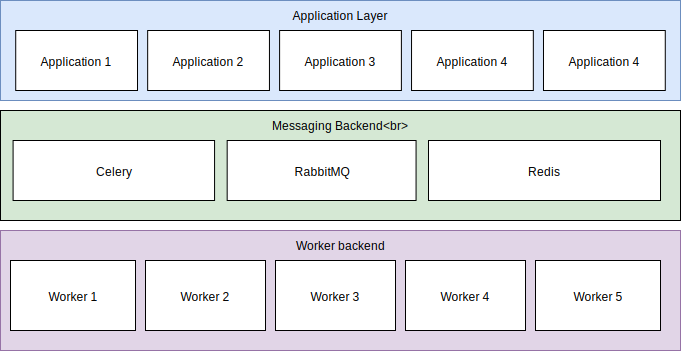

Title: Distributed Task with Celery
Date: 2019-07-11
Modified: 2019-07-11
Tags: Celery, Distributed Task
Authors: Harry Zheng
Summary: Node and code based setup to create flexible Celery worker system. 

This article discusses code base setup and typical worker Nodes configurations for a distributed Celery worker system. 


## Introduction

Celery is a asynchronous task queue/job queue system that facilitates communications between Producer system and Consumer system. A typical setup can be shown as below. 



An advantage of this setup is that it enables separation of heavy loading operation from rest of application layers. It's easier to maintain and perform updates without affecting the entire system, essentially decouples system components.

## Challenges

### Task definition

Task definition must be seen by both producer and consumer. But we would like to separate task implementation from producer to consumer. This is achieved through a shared celery task configuration code base between producer and consumer. 

### Task queue configuration

Different workers needs to be run on different host or queue. Otherwise worker might receive wrong task which were intended for other workers. 

Solution here is to use different queues for different tasks. 

## Code base solutions

### Git setup

Let's assume there are 2 git repos, one for `Producer` and one for `Consumer`. In order to shared `Task` definition, along with celery configuration, between `Producer` and `Consumer`, we create a 3rd git repo and add it as submodule for `Producer` and `Consumer`. So the setup looks like this. 

```
# producer git repo
producer/
	src/
		...
	celery_tasks/  # shared repo as submodule
		celery_config.py
		tasks.py
		utils.py
		...
	...

# consumer git repo
consumer/
	src/
		...
	celery_tasks/  # shared repo as submodule
		celery_config.py
		tasks.py
		utils.py
		...
	...

# shared celery task git repo
celery_tasks/
	celery_config.py
	tasks.py
	utils.py
	...

```

`celery_config.py` contains celery worker configurations which we will use to create celery app object. For example

```
# celery_config.py

import os
from celery_tasks.rabbitmq_config import RABBITMQ_PORT, RABBITMQ_PWD, RABBITMQ_USER, RABBITMQ_HOST

## Broker settings.
broker_url = f'pyamqp://{RABBITMQ_USER}:{RABBITMQ_PWD}@{RABBITMQ_HOST}:{RABBITMQ_PORT}'
result_backend = 'rpc://'

```

### Shared Task definition

`celery_tasks` repo contains dummy task class definitions. These classes needs to define class name, unique name of the task, run method and its arguments. These classes are defined in `tasks.py`. 

For example,

```
# tasks.py

import celery

class MagicCeleryTask(celery.Task):
    name = 'unique_magic_task'

    def run(self, arg1, arg2, arg3):
        """
        place holder method
        :param arg1: arg1 is for this
        :type arg1: int
        :param arg2: arg2 is for that
        :type arg2: int
        :param arg3: arg3 is for another
        :type arg3: int
        :return: result
        :rtype: str
        """
        pass

```

Consumers will inherit these classes and provide actual implementations, the `run` method, which enables it to perform real computations. Producers will utilize these dummy method to send tasks to celery backend. 

For example, in consumer code base, inherit `MagicCeleryTask` and implement actual computation. 

```
from celery_tasks.tasks import MagicCeleryTask

class ActualMagicCeleryTask(MagicCeleryTask):

	def run(self, arg1, arg2, arg3):
		""" actual implementation """
		return arg1 + arg2 + arg3

```

In producer, we can import the class directly. 

```
from celery_tasks.tasks import MagicCeleryTask

```


### Celery app queue configuration

Queue is configured based on task name to avoid worker conflicts. In `celery_tasks`, we created a `create_worker_from` method defined in `utils.py`. 

```
# utils.py

def create_worker_from(WorkerClass, celery_config='celery_tasks.celery_config'):
    """
    Create worker instance given WorkerClass
    :param WorkerClass: WorkerClass to perform task
    :type WorkerClass: subclass of celery.Task
    :param celery_config: celery config module, default 'celery_tasks.celery_config'. This depends on
                            project path
    :type celery_config: str
    :return: celery app instance and worker task instance
    :rtype: tuple of (app, worker_task)
    """
    assert issubclass(WorkerClass, celery.Task)
    app = celery.Celery()
    app.config_from_object(celery_config)
    app.conf.update(task_default_queue=WorkerClass.name)  # update worker queue
    worker_task = app.register_task(WorkerClass())

    return app, worker_task

```

In producer and consumer, we use this method and task class to create celery app and worker class instances for each task. Worker class instances are used to produce and consume tasks. 

For example, in consumer, 

```
from celery_tasks.tasks import MagicCeleryTask
from celery_tasks.utils import create_worker_from

class ActualMagicCeleryTask(MagicCeleryTask):

	def run(self, arg1, arg2, arg3):
		""" actual implementation """
		return arg1 + arg2 + arg3
		
# create celery app
app, _ = create_worker_from(MagicCeleryTask)

# start worker
args = [
    '--without-gossip',
    '--without-mingle',
    '--without-heartbeat'

]
app.worker_main(argv=args)
```

For example, in producer,

```
from celery_tasks.tasks import MagicCeleryTask
from celery_tasks.utils import create_worker_from

# create worker
_, worker = create_worker_from(MagicCeleryTask)

# send task to queue and get result
result = worker.delay(1,2,3).get()

```

