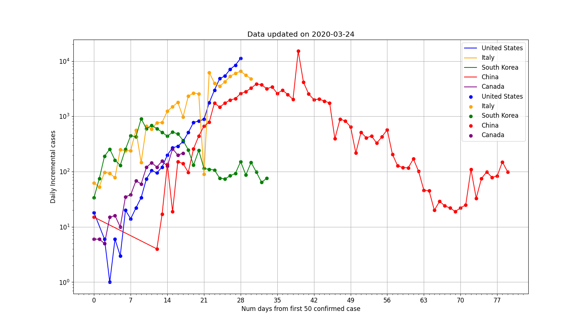
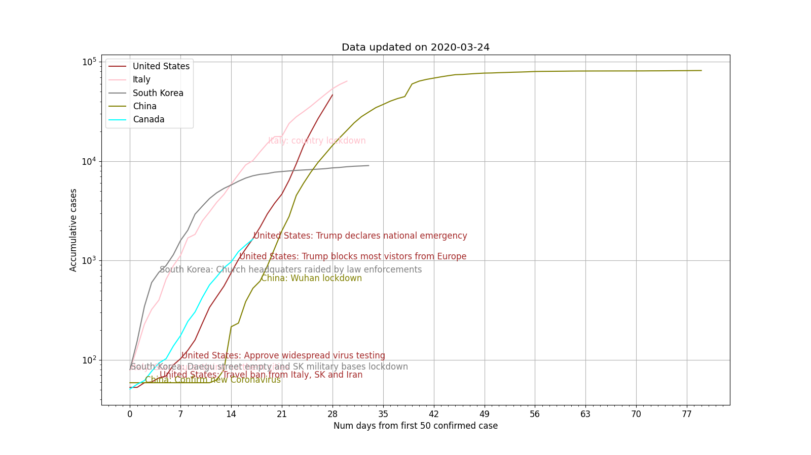

Title: Coronavirus 2019 Analysis
Date: 2020-03-15
Modified: 2020-03-15
Tags: Data Analysis, Coronavirus
Authors: Harry Zheng
Summary: Analysis on current coronavirus situation. 

# Country to country comparison

Here we put several country together and highlight significant events happened in each country. 

Related source code and data can be found [here](https://github.com/hazelement/wuhan-virus-study).
## Country incremental

Daily updated chart. On x axis we plot number of days since first 100 accumulative cases. On y axis, we show daily incremental cases in log scale. With this chart, we can easily tell whether the virus is spreading exponentially or it's slowing down. 

Static chart.

## Country accumulative 

## Interesting spots:

### May 12

Canada, US and Italy have plateaued. However, we do see South Korea is struggling in the last few days. It's a good indication that the virus can easily bounce back if people don't follow social distancing properly. 

Both US and Canada has started easing virus lock down rules last week. So we will how the curve trends in 2 weeks. 

### March 24

* US has taken over Italy on daily incremental.
* Both US and Italy will have more cases than China
* Italy has seen effective results from the lock down. Their daily incremental is flattening out. 

### March 15

* After US approved widespread virus testing, number of confirmed cases jumped. This means that the virus was already spreading actively. 
* Second jump in US is interesting but there is no significant public event associated with it. 
* After China's Wuhan lock down. It takes 4 weeks for the virus to calm down. Given virus takes 2 weeks to show symptom on average. We can probably say the transmission slows down after 2 weeks of lock down. 
* Given Wuhan's data, we can say it will take 2 weeks of lock down to slow down the transmission and another 2 weeks to contain the spread. If lock down stops within this 4 weeks. The effort will be gone and we may see the virus start spreading again. 
* Italy started national lock down on day 20. We shall see how this pan out according to discovery above. 

Important call out:

* Controlling the spread using lockdown is important as it eases the load our health system. 
* It will take 4 weeks for lockdown to effectively decrease cases. That is if the healthy care system is currently under load or over loaded and we start the lockdown right now. The situation in our medical system will not improve until 4 weeks later. 

# References

## Virus data
* [WHO Coronavirus full data](https://covid.ourworldindata.org/data/full_data.csv)

## Timeline events

* [South Korea](https://en.wikipedia.org/wiki/2020_coronavirus_pandemic_in_South_Korea#Timeline)
* [Singapore](https://en.wikipedia.org/wiki/2020_coronavirus_pandemic_in_Singapore)
* [Italy](https://en.wikipedia.org/wiki/2020_coronavirus_pandemic_in_Italy)
* [NYTimes](https://www.nytimes.com/article/coronavirus-timeline.html)
* [Coronavirus pandemic](https://en.wikipedia.org/wiki/Timeline_of_the_2019%E2%80%9320_coronavirus_pandemic)

