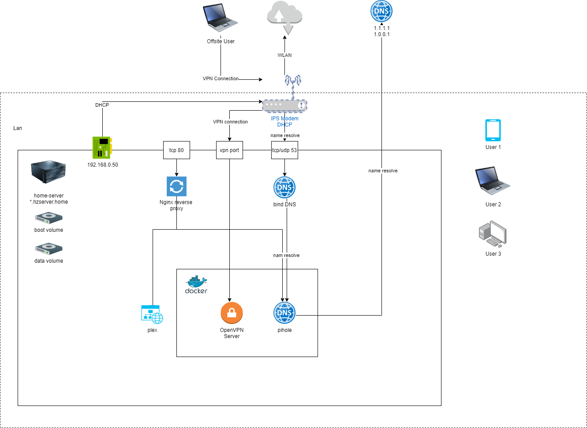

Title: Home Lab
Date: 2020-07-10
Modified: 2020-07-10
Category: misc
Tags: server, network
Authors: Harry Zheng
Summary: Servers at home for entertainment and learning

# Introduction

This article summarizes my home lab setup. I used the setup to server entertainment and to support software development in my free time. The entire set runs on an laptop with 32GB of memory with Ubuntu 18.04 installed.

This is just a premliminary setup as I add more stuff over the years. I might switch to a proper hypervisor installation in the future. 

# Docker, Virtual Box and Server itself

I divide my services into 3 partitions. 

* [Host] support services that run on the host system. These are the crucial services that I always need, such as Nginx and bind DNS server. 
* [Docker] Services that can be containerized. and sometimes are one off experiments. 
* [VirtualBox] Services that might interfere with host network and I want to keep it separated. So services that host OS doesn't support. 

# Host services

In host, I installed [webmin](http://www.webmin.com/) for each remote management on the host itself. This way, I can directly get system information on the host. 

Through webmin, I installed nginx and bind DNS. 

## bind DNS

It runs as a DNS resolver for my home network. Rather than accessing my other services using IP addresses, I create DNS entires for these services' IP in bind DNS. So that I can access them using a URL. 

## Nginx

Reverse proxy for services. It redirects requests to services. 

## Plex

Home entertainment services. Plex looks at my data volume where I stored all my movies and TV shows. I'm able to acess my library on my phone using Plex's app. There is also a web UI available. I can also cast my media to TV through Chromecast. 

I installed Plex on host to avoid file permission issues on my data volume. I have other services adding content to the data volume in docker and it's tricky to setup Plex in docker to share the same user. 

# Docker

## Nextcloud

Nextcloud server cloud storage services to my home network. I persist its data by mounting a folder in the data volume into the docker. 

## OpenVPN

To allow connect to home network from outside, I run a OpenVPN inside a docker. 

## Watchtower

Watchtower automatically updates all docker containers to their latest images. 

## Portainer

An admin web UI to see and mamange running containers. 

## Pihole

DNS based ad blocker

# VirtualBox

## OneDrive

I have a windows machine running in VirtualBox. It syncs my Onedrive and share the Onedrive folder over samba in my home network. I don't need to map static IP to this machine because windows machines are dicoverable in local network. 

## GameServers

I also have some VMs running as game servers. 

# DNS resolution

To resolve local DNS name and perform add filtering using pihole. I've set ISP's modem to use bind DNS as look up server. Bind DNS resolves local DNS names and forward the rest to pihole. 

Pihole filter out blacklisted ad domains and forward the rest to `1.1.1.1`and `1.0.0.1`. 

