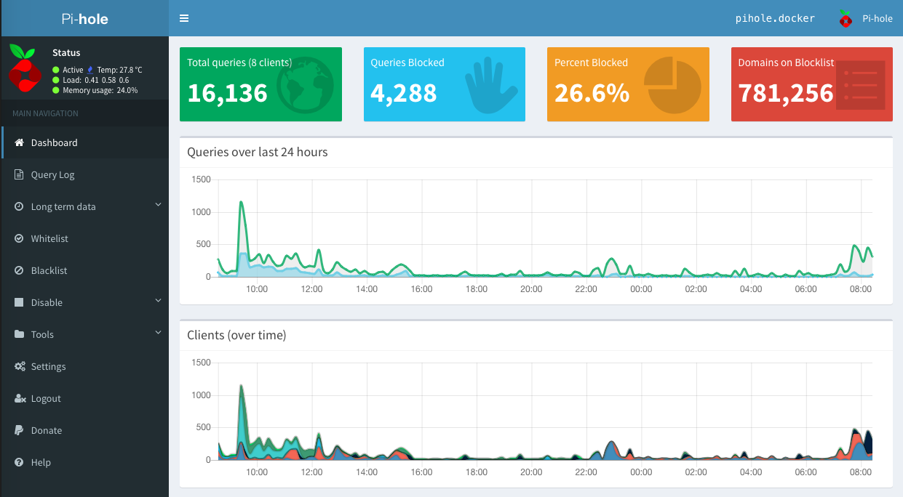
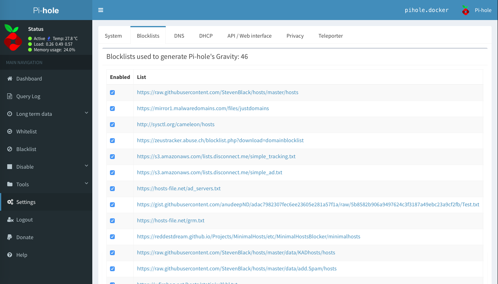
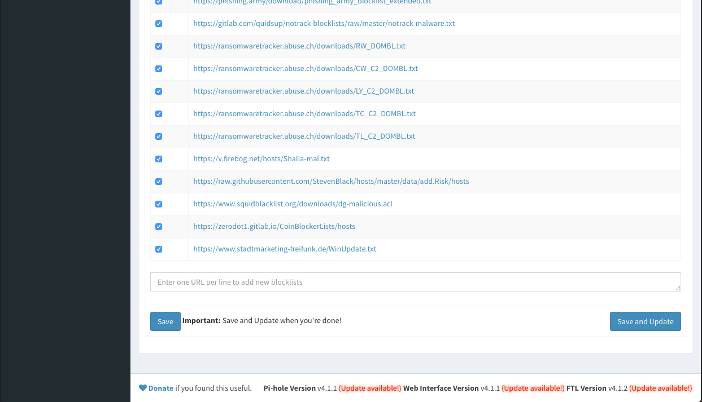

Title: Use Pihole to Prevent Windows 10 Auto Update
Date: 2019-04-07
Modified: 2019-04-07
Tags: Pihole, Windows 10 update
Authors: Harry Zheng
Summary: Use Pihole as DNS server to blacklist Windows 10 update domain so that auto updates can be blocked


## Pihole

For those who haven't heard about Pihole, it's a light DNS service that can run on a device as small as a raspberry pi. It can be used as a DNS service to block certain unwanted domains. Most popular usage is to block advertisement and online tracking services. The GitHub page is [here](https://github.com/pi-hole/pi-hole). 

## Running a Pihole in docker

We will be using docker to run a Pihole service. Pihole has an official docker image that can be found [here](https://github.com/pi-hole/docker-pi-hole). A `docker-compose` file is also provided on their GitHub page. It's posted here for convenience. 

```
version: "3"

# More info at https://github.com/pi-hole/docker-pi-hole/ and https://docs.pi-hole.net/
services:
  pihole:
    container_name: pihole
    image: pihole/pihole:latest
    ports:
      - "53:53/tcp"
      - "53:53/udp"
      - "67:67/udp"
      - "80:80/tcp"
      - "443:443/tcp"
    environment:
      TZ: 'America/Chicago'
      # WEBPASSWORD: 'set a secure password here or it will be random'
    # Volumes store your data between container upgrades
    volumes:
       - './etc-pihole/:/etc/pihole/'
       - './etc-dnsmasq.d/:/etc/dnsmasq.d/'
    dns:
      - 127.0.0.1
      - 1.1.1.1
    # Recommended but not required (DHCP needs NET_ADMIN)
    #   https://github.com/pi-hole/docker-pi-hole#note-on-capabilities
    cap_add:
      - NET_ADMIN
    restart: unless-stopped
```

Let's assume `Pihole` is running on a local server with IP address `192.168.0.254`. On web browser, go to that IP address. A pihole page should show up. Click on `Did you mean to go to the admin panel?`. This will bring us to the admin page. Click on `login in` and enter the password defined in the `docker-compose.yml` file. 



## Configure Pihole to block Windows 10 update server

Pihole's blocking mechanism are based on blacklist and whitelist. Navigate to `Setting > Blocklists`. Here you can add as many lists as you want. There are many community list out there that block different types of services. 



You can see I have a lot of them added. At the bottom of the list, we can see a place where we can add more lists. 



The URL we are using is from [here](https://www.stadtmarketing-freifunk.de/WinUpdate.txt). Many thanks to krathalan and in2016minewastaken from reddit. Enter the url and click on `Save and Update` to update the rules, 

## Configure Windows to use the Pihole as DNS server

There are 2 options here. Configure specific machines we would like to prevent auto update or apply this on all Windows 10 machines on the local network. 

1. To configure specific machines, just configure the DNS server on each machine to `192.168.0.254`. 
2. To configure for all machines on the local network, configure router's DNS server to `192.168.0.254`. Refer to your router manual to setup this. 

And that's it! Next time Windows machines try to get an update, it will hit a wall at our DNS server and fail. 


